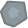

We need some objects to go in our game. In this example, we'll use assets from [kenney.nl](https://kenney.nl/)'s asset pack [Space Shooter Redux](https://www.kenney.nl/assets/space-shooter-redux).

We need:
- ships (us and them)
- asteroids (we're going large, medium, small)
- powerups/tokens
- laser blast
- explosions

Here are the assets we'll use:

Download your assets, and then drag them into the assets panel at the bottom of the Unity screen.

