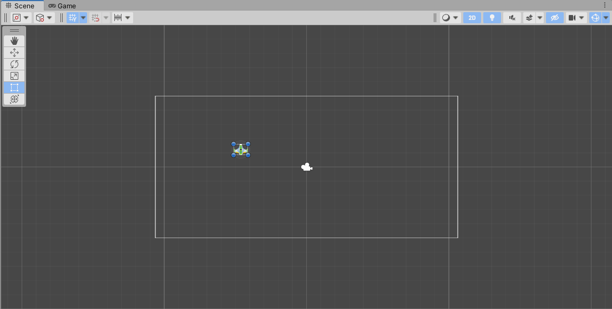
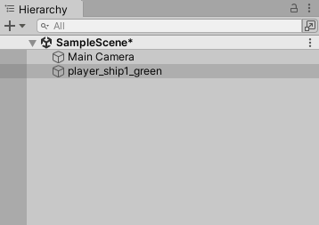
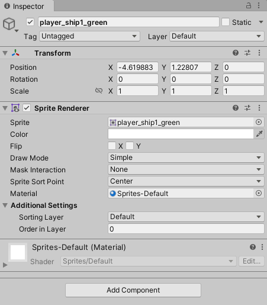

Drag the sprite (image) for your player ship into the **Scene** to create the `GameObject` for your player.

The white rectangle shows what is visible on the **main camera**, whose location is shown by the camera image in the centre of the scene. The main camera is what will appear on our **screen**, so for our basic example, anything inside that white rectangle will be visible on screen, and anything outside will not be.

You will see that the scene's [Hierarchy]() now shows both the main camera and your new player object (which will have a silly name based on the name of the image file).

As the player object is selected, you'll see it highlighted in both the hierarchy and the scene, and the **Inspector** panel will show all the relevant information for the selected object.

