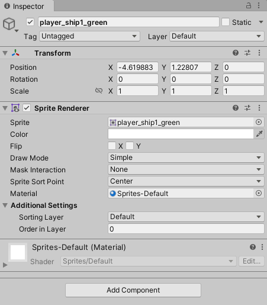

The inspector panel shows information about a selected `GameObject`, including all its [components]().

You can adjust values in the inspector by:
- typing values directly in an input field
- dragging up/down or left/right on input field's text label,
- dragging an object from the hierarchy or assets panes onto a reference field (the fields with a little "target" at the right)

The dragging a label option can be really handy for working out approximately what the value for some property should be, before choosing a specific value for it.

Go ahead and rename your player ship to **player** now. Also, tag the player as a "Player" using the Tag menu underneath the name field.

All GameObjects have a [`transform`]() component, which manages the position, rotation and scale of the object. Try dragging on the "X" of the position property, and watch as the ship moves left and right. Similarly try dragging the Z of the rotation to see the ship turn around.

Next to the scale is a little chain, which either locks the scales or leaves them independent. If there is a line through the chain, the chain is broken, and you can scale the three dimensions independently. If the chain is active then as you double the X scale, for example, the Y and Z scales will double also. This maintains the **aspect ratio** of the object, which is an import part of its look. Generally, you should not change the aspect ratio of anything unless you are really sure what you're doing.

At the bottom of the inspector is the **Add Component** button, for adding additional components. We will use that now.
