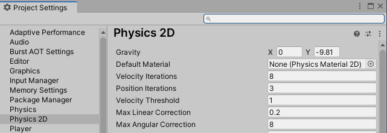
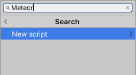
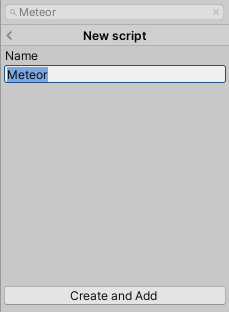

## Disable gravity
At the moment our player moves, but only because of gravity, and there isn't a lot of gravity in space. So let's turn that off. In the menu bar, go to Edit > Project Settings, choose Physics 2D from the sidebar, and set the Y value of Gravity to zero (0).

## Create player script

With your player's game object selected, from the inspector choose **Add component**. In the search field, type "Player", and then choose *New script*, and then *Create and Add*.

You will see the player script appears in the Assets panel, and if you look near the bottom of the Inspector for your player object, you'll see an entry labelled "Player (Script)". We'll be coming back to this many times.


If you haven't already, you should go to *Edit > Preferences*, choose *External Tools*, and make sure that the *External Script Editor* option is set to *Visual Studio Code*, not *Open by file extension*.


Double click the player script in the assets panel to open it for editing.

## Turning & moving

(The full code is at the end of this page.)

The script will already contain some basic code. It will call for some standard library parts (lines 1-2) and the main Unity code library (line 3). The rest of the file defines a **class**. You don't need to know anything particularly about classes to get by here, but...


It it is vital that the name of the class (the word after "public class") exactly matches the file name. If you ever rename the file or the class, you need to adjust the other to match.


We will declare a couple of variables for the class:
- `rotSpeed`, (rotation speed) a tunable number to adjust how quickly we can turn;
- `linSpeed`, (linear speed) a tunable number to adjust how quickly we can change our speed;
- `rb`, a reference to a Rigidbody2D component, which we will use to interact with the physics engine.

In the `Start()` method, we wire up our `rb` variable to the player object's Rigidbody2D component.

In the `Update()` method, we have a one line bit of code which uses the Horizontal axis input to adjust the rotation of the player object. The rest of that code increases or decreases the velocity depending on the Vertical axis input. On a keyboard, the inputs are WASD and the arrow keys.


Unity is often very slow to notice changes to scripts. After you've saved the changes to your scripts, head back to Unity and hit Ctrl-R (shortcut for *Assets > Refresh*) to force Unity to recompile and update your scripts.


Once you've done that, you'll notice that the Player (Script) section has sprouted two new lines, for the rotSpeed and linSpeed variables. This is because they were declared public, which means they are visible to other components. (The rb variable, by contrast, is private, so is not visible.) You will need to set these to non-zero values or your ship won't move. Start with these:
- `rotSpeed` = 1000
- `linSpeed` = 5

and tune them to your preference.


using System.Collections;
using System.Collections.Generic;
using UnityEngine;

public class Player : MonoBehaviour
{
    public float rotSpeed;
    public float linSpeed;
    private Rigidbody2D rb;

    // Start is called before the first frame update
    void Start()
    {
        rb = GetComponent<Rigidbody2D>();
    }

    // Update is called once per frame
    void Update()
    {
        //Update rotation
        rb.MoveRotation(rb.rotation - Input.GetAxis("Horizontal") * rotSpeed * Time.deltaTime);

        //Update velocity
        Vector3 pos = transform.position;
        float y = Input.GetAxis("Vertical") * linSpeed * Time.deltaTime;

        Vector2 vChange = new Vector2(0, y);
        vChange = transform.rotation * vChange;
        rb.velocity += vChange;
    }
}
