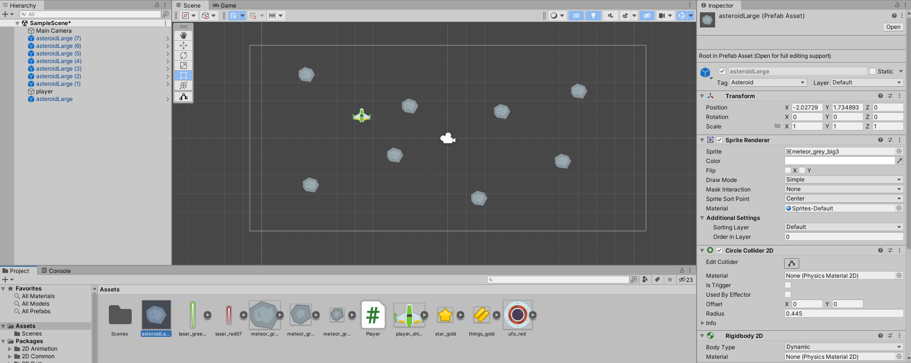

Let's add some asteroids. Since asteroids are all broadly alike, it'd be great if there was a way to set up one up with all the components and scripts we need and then just clone it, and there is: prefabs!

Drag one the large meteor image into the scene, and rename it `asteroidLarge`. In the tag menu, select "Add tag". Under "tags", it will say "List is empty". Click on the + at the right end of that box, and enter "Asteroid" and hit Save.

Now click on your asteroid in the scene (or hierarchy) and you should now be able to tag the asteroid as an Asteroid.

Give it a `Rigidbody2D` and `CircleCollider2D` component.

If you run your game now, you should be able to push the asteroid around with your ship.

To make a prefab from your asteroid, drag the asteroidLarge entry from the hierarchy back down into the Assets panel. The `asteroidLarge` should now have a blue filled icon, rather than the black outline one the other objects have. This indicates it is a prefab. The new prefab in the assets panel will have a grey background around the sprite and, if you select it, the inspector will show it is a Prefab Asset.

You can drag your prefab asteroid into the scene to create more copies of it. Do that now, so you have six or so asteroids.

Now if you run your game you can knock one asteroid into another.