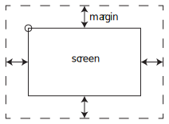



At the moment, once an asteroid (or your ship) disappears off the edge of the screen, it will continue moving forever and you'll likely never find it again. In some games you might choose to attach the camera to the player so you can move around and keep the player on the screen, but in this case we're going to wrap the screen: when the player moves off one edge, they'll reappear on the other.

## Player
To do that, we add some more code to the `Update()` method of the player script. The `margin` property we use in this code can be tuned according to preference. The object must go past the edge of the margin, not just the screen, to be teleported to the other edge. The value used in this example, 50, seems to work okay, but feel free to play around.


using System.Collections;
using System.Collections.Generic;
using UnityEngine;

public class Player : MonoBehaviour
{
    public float rotSpeed;
    public float linSpeed;
    private Rigidbody2D rb;

    // Start is called before the first frame update
    void Start()
    {
        rb = GetComponent<Rigidbody2D>();
    }

    // Update is called once per frame
    void Update()
    {
        //Update rotation
        rb.MoveRotation(rb.rotation - Input.GetAxis("Horizontal") * rotSpeed * Time.deltaTime);

        //Update velocity
        Vector3 pos = transform.position;
        float y = Input.GetAxis("Vertical") * linSpeed * Time.deltaTime;

        Vector2 vChange = new Vector2(0, y);
        vChange = transform.rotation * vChange;
        rb.velocity += vChange;

        //Handle screen wrapping
        int margin = 50;
        //Work out our screen position
        Vector2 screenPos = Camera.main.WorldToScreenPoint(transform.position);

        //Check if we've moved too far offscreen
        if( screenPos.x > Screen.width+margin ){
            //off right, move to left
            screenPos.x = -margin;
        }else if( screenPos.x < -margin ){
            //off left, move to right
            screenPos.x = Screen.width+margin;
        }
        if( screenPos.y > Screen.height+margin ){
            //off bottom, move to top
            screenPos.y = -margin;
        }else if( screenPos.y < -margin ){
            //off top, move to bottom
            screenPos.y = Screen.height+margin;
        }

        //Work out our new world position
        Vector3 newPos = Camera.main.ScreenToWorldPoint(screenPos);
        transform.position = new Vector2(newPos.x, newPos.y);
    }
}


## Asteroids
We can also add screen wrapping for our asteroids. Make a new script for our asteroids by selecting the prefab asteroid asset and choosing *Add component* from the inspector. Type "Asteroid" into the search bar, and choose New Script and press Enter, as you did for the player script.

Open the new Asteroid script and add just that new screen wrapping code to the Asteroid `Update()` method.


using System.Collections;
using System.Collections.Generic;
using UnityEngine;

public class Asteroid : MonoBehaviour
{
    // Start is called before the first frame update
    void Start()
    {

    }

    // Update is called once per frame
    void Update()
    {
        //Handle screen wrapping
        int margin = 50;
        //Work out our screen position
        Vector2 screenPos = Camera.main.WorldToScreenPoint(transform.position);

        //Check if we've moved too far offscreen
        if( screenPos.x > Screen.width+margin ){
            //off right, move to left
            screenPos.x = -margin;
        }else if( screenPos.x < -margin ){
            //off left, move to right
            screenPos.x = Screen.width+margin;
        }
        if( screenPos.y > Screen.height+margin ){
            //off bottom, move to top
            screenPos.y = -margin;
        }else if( screenPos.y < -margin ){
            //off top, move to bottom
            screenPos.y = Screen.height+margin;
        }

        //Work out our new world position
        Vector3 newPos = Camera.main.ScreenToWorldPoint(screenPos);
        transform.position = new Vector2(newPos.x, newPos.y);
    }
}


Refresh your assets and run your game; everything should wrap correctly now.