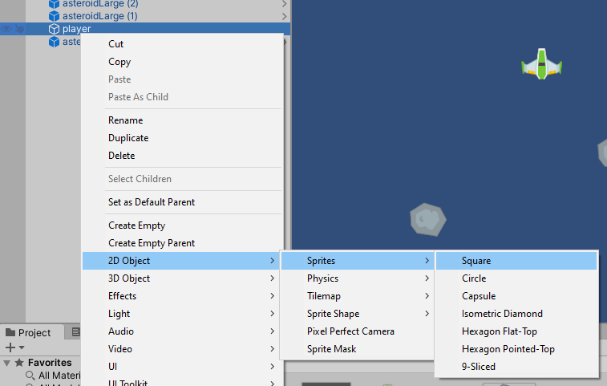
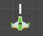

Let's make a gun. Our gun will be slightly odd, in that it won't be attached directly to the ship. Instead, the thing we're going to build will be invisible, and sit just in front of the ship. When we press the fire button (left Ctrl by default), our player will generate a laser blast at the location of the gun, which will then travel forward at speed.

We need to make sure that the gun object is a "child" object of the player, so that the gun is attached to the player and moves as the player moves. Right click on the player in the hierarchy, and choose *2D Object > Sprites > Square*.

You'll notice that there is a new object called Square and it is *nested* inside your player. Your player object now has a little arrow you can click on which will show and hide its children. Rename your Square "gun1".

Because the gun is a child of the player, its coordinate system is defined relative to the player, not to the world coordinate system. You'll notice that the coordinates for the gun are currently `(0, 0, 0)` and that puts it right on top of your ship.

Use the transform panel to set the *scale* of your gun to: `(0.1, 0.5, 1)`. It should now be a long thin rectangle down the centre axis of the ship. Adjust the Y position until the gun is just out the front of the ship. We've set ours to `0.75`. Your ship and gun should look similar to the image below.

We are not going to add any components to our gun---no colliders or Rigidbody---so it won't affect anything else in the game; it's as if it isn't there at all. And we can now turn off the Sprite Renderer by unchecking the box next to the component's title, and it will be completely invisible.