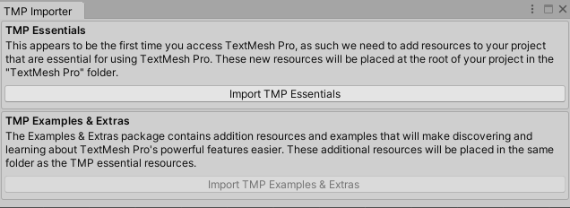
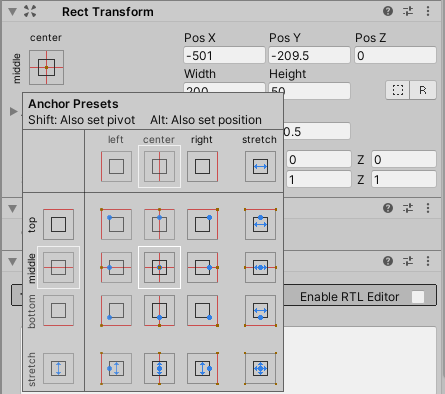

Let's give the user a sense of how well they're doing; we'll give them a point for every asteroid they shoot.

We'll start by setting up the score display.
Right click in the hierarchy and choose *UI > Text - TextMeshPro*.

You'll likely be presented with this box:

You'll need to click the "Import TMP Essentials" button to continue. If you are keen to learn more about TextMesh Pro's features, you can click the second button as well, but if you're just going to rely on this tutorial series, don't worry about it, and just close the window once the essentials have been added.

Back in your Unity window, you'll notice that a `Text (TMP)` object has been added inside a `Canvas` in your hierarchy. There will be the corner of a large yellow box in the middle of the scene (this is the edge of the new canvas), and your Text object will be selected for editing in the Inspector.

Go ahead and call this "scoreDisplay". In the TextMeshPro component, replace the text "New Text" with "Destroyed: 0".

Play your game, and you should see some text near the bottom left. Let's fix this placement up. Double click on the Canvas in the hierarchy to focus on it. You will see the text is in a silly location.

Select your scoreDisplay object and head to the inspector.

Click on the target-like image. This sets where the object is anchored to the canvas. We'll anchor our score to the top left for now. By holding down Alt as we select the "top left" option, it will also position our score in the top left.

You should now see the score display in the top left, and the anchor (a white diagonal cross) also in the top left.

To go back to your game scene, double click on the Main Camera.

Now if you play your game, you'll see the score in the top left.