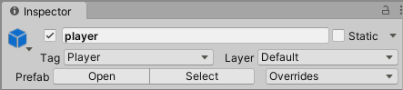
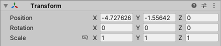
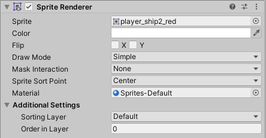
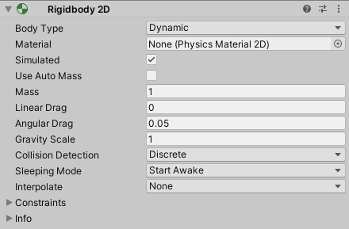
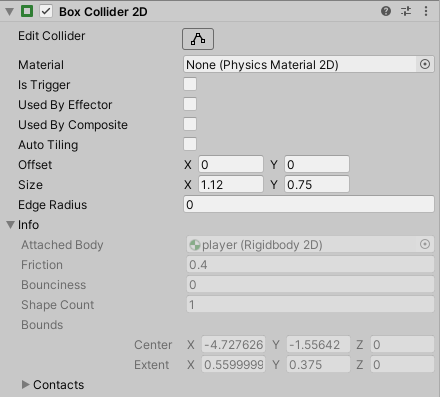

All [game objects]() have one or more **components**.

Here are the ones you're most likely to encounter.

## Name


This is not actually a component, but it lives at the top of the inspector panel, above all the components. Here you can give your object a meaningful name as well as attach a tag, which is useful for identifying things during collisions.

---

## Transform


All GameObjects have a transform component, which manages the position, rotation and scale of the object in the scene.

---
## Sprite Renderer


Most game objects will appear on the screen in the form of some kind of image. The sprite renderer handles drawing that image. You can disable the sprite renderer by unchecking the box by the title. This is useful if you need an invisible object for some reason.

---
## Rigidbody2D



2D vs 3D: There is a Rigidbody2D for 2D games, and a Rigidbody for 3D games. Make sure you have the right one!

The Rigidbody component makes the object available to the physics engine. This means it will be affected by gravity, if your game has gravity enabled, and it can have forces applied to it. (You will mostly have a collider attached to any object with a Rigidbody as well.)

---
## Collider2D



2D vs 3D: There is are types of Collider2D for 2D games, and types of Collider for 3D games. Make sure you have the right one!

There are several of colliders of different shapes and complexities, of which the `BoxCollider2D` is the simplest (others you might use are `CircleCollider2D`, `CapsuleCollider2D` and `PolygonCollider2D`). Colliders are responsible for determining when objects start and end colliding with other objects. If two colliders overlap, there is a collision. Note that a collision between two objects will only be registered if *both* objects have collider components.

You can modify the size/shape of the collider to better match your sprite by clicking the button next to `Edit Collider`.

When a collision begins (i.e. colliders start to overlap) the method:

```cs
void OnCollisionEnter2D(Collision other)
```

will be called, and when the collision ends, the method:

```cs
void OnCollisionExit2D(Collision other)
```

will be called, if they exist in a script attached to the object. You only need to define those methods if you want to do something particular in your game. If your objects also have Rigidbody components, the physics of the collision will be handled automatically by the physics engine.

If you need an object to respond when something passes over it, but you don't want it to get in the way (think of the start/finish line on a top-down racing game), select the `Is trigger` option in the object's collider, and now object won't cause collisions. Instead of any `OnCollision` methods being called, these methods will be called:

```cs
void OnTriggerEnter2D(Collider2D other)
```

and

```cs
void OnTriggerExit2D(Collider2D other)
```
