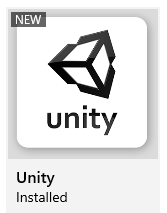

You will need three main tools for developing in Unity, and all can be found on the TMC Company Portal.

## Unity Hub
Unity Hub is responsible for managing licences and which version of Unity (if you have more than one) is associated with which project. You will start your workflow in Unity Hub, where you will select which project you'll work on, or start a new one.
## Unity
Unity (also referred to as the Unity Editor) is the heart of things. As it is regularly updated, you might eventually find yourself with more than one version. Because we won't be doing anything terribly adventurous, it *probably* won't matter which version you have.
## Visual Studio Code
When you need to edit code files in Unity, it will open up Visual Studio Code, and you'll edit them in that.